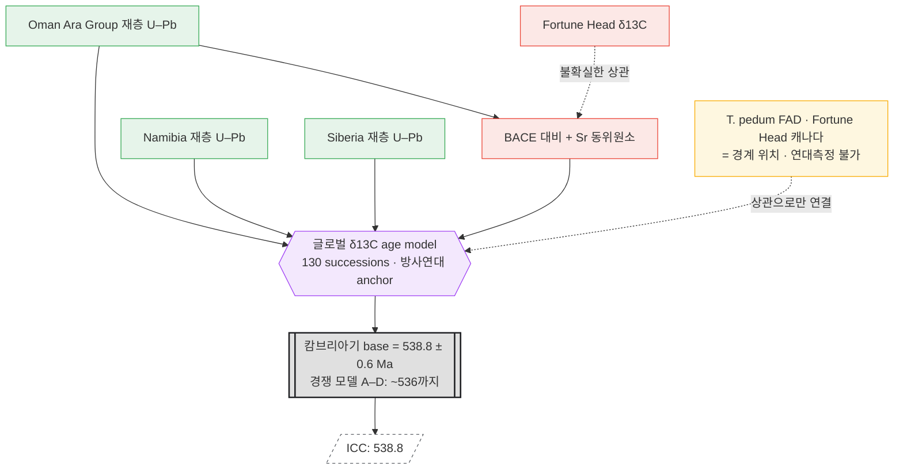

# 케이스 스터디 — 캄브리아기 base (Fortune Head GSSP): correlation이 load-bearing

> 상태: 세 번째 사례. [case-permian-triassic.md](case-permian-triassic.md)(국소 보간)와
> [case-precambrian-gssa.md](case-precambrian-gssa.md)(결정된 상수)에 이어,
> **중간 티어 (b) 섹션 간 상관(correlation)이 숫자를 만드는** 유형을 검증한다. 사실은 문헌 확인(§8).

## 1. 왜 이 사례인가 — tier (b)의 표본

P–T에선 경계 숫자가 *같은 섹션*의 위·아래 재층 보간에서 나왔다(tier a).
캄브리아기 base는 정반대다: **GSSP 섹션 자체엔 연대측정할 화산재가 없다.**
숫자는 **다른 대륙의 датable한 섹션에서, 화학층서 상관으로 끌어온다.**
게다가 그 상관이 어렵고 논쟁적이라, 경계 연대가 그동안 크게 흔들렸다 — tier (b)의 성격과 위험을 한 번에 보여준다.

## 2. 경계 정의 (Layer 1 / GSSP)

- **위치:** Fortune Head, Burin 반도, 캐나다 뉴펀들랜드 남동부. Chapel Island Fm의 Member 2A(Quaco Road Mbr)
  기저 위 23 m. **1992년 비준.**
- **마커:** 생흔화석(trace fossil) ***Treptichnus pedum*** 의 최초출현(FAD).
- 알려진 문제: GSSP 지점이 실제 *T. pedum* 최초 출현보다 **위**에 놓여 있고, 이 층을 시베리아·남중국 등
  대부분의 고대륙과 정밀 상관하기 어렵다 → GSSP 재검토 제안까지 나와 있음.

## 3. 원시 관측은 '다른 곳'에 있다 (Layer 2)

Fortune Head엔 방사연대 앵커가 없다. 숫자를 대는 датable한 재층은 **다른 대륙**에 있다:

- **Oman (Ara Group)** — U–Pb 재층. 고전 값 **542.0 ± 0.3 Ma** (선캄–캄 경계).
- **Namibia**, **Siberia** — 각각의 재층 U–Pb.
- 최근 고정밀 CA-ID-TIMS는 이들을 **538.8 Ma 근처**로 재정렬. (단 Oman 재층은 침식면·재퇴적 정황이 있어
  실제 excursion보다 앞설 수 있다는 caveat.)

각 관측은 P–T처럼 불변·인용 가능한 사실이지만, **경계 지점과 물리적으로 떨어진 다른 섹션에 있다.**

## 4. Correlation이 숫자를 만든다 (Layer 3.5 — load-bearing)

경계 지점(Fortune Head)과 датable 재층(Oman 등)을 잇는 것은 **화학층서 상관**이다:

- **BACE (basal Cambrian carbon isotope excursion)** — 기저 캄브리아 δ¹³C 음(-)의 이탈. 전 지구 마커.
- δ¹³C 합성곡선 + **Sr 동위원소 층서**로 여러 대륙의 섹션을 엮고, **방사연대에 anchor**.
- 최근 연구는 **130개 succession**의 글로벌 age model(δ¹³Ccarb + ⁸⁷Sr/⁸⁶Sr + U–Pb)을 구성.

**결과가 불안정하다.** 현재 ICS 값은 **538.8 ± 0.6 Ma**(Terreneuvian/Fortunian base)지만, 경쟁 age model
(A–D)은 BACE의 시간적 위치를 달리 잡아 **최대 ~3 Myr 젊게(~536 Ma)** 볼 여지를 남긴다.
즉 **경계 숫자는 어느 상관·age model을 택하느냐에 직접 의존**한다.

## 5. 세 사례 대조

| | 경계 위치 정의 | 숫자가 나오는 곳 | 중간 티어 | ± |
|---|---|---|---|---|
| P–T (Meishan) | GSSP · *H. parvus* FAD | **같은 섹션** 재층 보간 | (a) 국소 age-depth | 있음(좁음) |
| 선캄브리아 | **GSSA** (숫자=정의) | 결정(위원회) | — (상류 없음) | 없음 |
| **캄브리아 base (Fortune Head)** | GSSP · *T. pedum* FAD | **다른 대륙** 재층 + 상관 | **(b) 섹션 간 correlation** | **넓음·논쟁적** |

## 6. 노드 그래프



### ASCII 요약

```
 [Oman U–Pb]───┐
 [Namibia]─────┼──▶{글로벌 δ13C age model}──▶[[538.8 ± 0.6 Ma]]══▶ ICC
 [Siberia]─────┘            ▲   ▲                (경쟁: ~536)
                            │   ┊ (Fortune Head 위치는
        [BACE + Sr]─────────┘   ┊  상관으로만 연결 · 점선=불확실)
                                ┊
        [T. pedum FAD · 연대측정 불가]┄┄┘

  P–T:  데이터→모델→[숫자]         (숫자와 경계가 같은 섹션)
  선캄: [숫자]=정의                 (상류 없음)
  캄브: [다른 대륙 데이터]┄상관┄▶[숫자]  (숫자와 경계가 다른 섹션 — 상관이 다리)
```

## 7. cdGTS 모델에 대한 함의

1. **중간 티어 (b)가 실재하고, load-bearing이며, 위험하다.** P–T의 국소 보간(a)과 달리 여기선
   상관이 숫자의 **주경로**다. 상관 엣지가 곧 불확실성의 주된 원천 → node-graph의 *"엣지가 분포를 흘린다"* 가
   가장 노골적으로 드러나는 사례.
2. **게이트웨이 provenance가 대륙을 건넌다.** `538.8`을 역추적하면 Fortune Head가 아니라 Oman·Namibia·Siberia와
   δ¹³C 곡선이 나온다. provenance 그래프가 **지리적으로 분산**된다는 걸 스키마가 감당해야 한다.
3. **"age model 선택"이 1급 노드다.** 경쟁 모델 A–D가 같은 데이터에서 다른 숫자를 낸다 →
   node-graph의 *what-if / 노드 스왑*이 실제 학계 논쟁의 형태. cdGTS라면 이 경쟁 모델들을
   **대안 그래프 브랜치**로 나란히 두고 diff를 보여주는 게 자연스럽다.
4. **경계 위치 노드와 연대 앵커 노드가 분리된다.** GSSP는 *어디가* 경계인지만 고정하고, *언제*는 상관 서브그래프가
   댄다. 두 노드를 하나로 뭉치면 안 된다는 설계 제약.

## 8. 출처

- Cambrian — Wikipedia (base 538.8 Ma, Terreneuvian): https://en.wikipedia.org/wiki/Cambrian
- Fortune Head — Wikipedia: https://en.wikipedia.org/wiki/Fortune_Head
- GSSPs — The Cambrian System (ICS Cambrian Subcommission): https://cambrian.stratigraphy.org/gssps
- Babcock et al. 2014, *J. African Earth Sci.* — Proposed reassessment of the Cambrian GSSP:
  https://www.sciencedirect.com/science/article/abs/pii/S1464343X1400209X
- Bowyer et al. 2022, *Earth-Science Reviews* — Calibrating the temporal and spatial dynamics of the
  Ediacaran–Cambrian radiation (글로벌 δ13C age model A–D):
  https://www.sciencedirect.com/science/article/abs/pii/S0012825221004141
