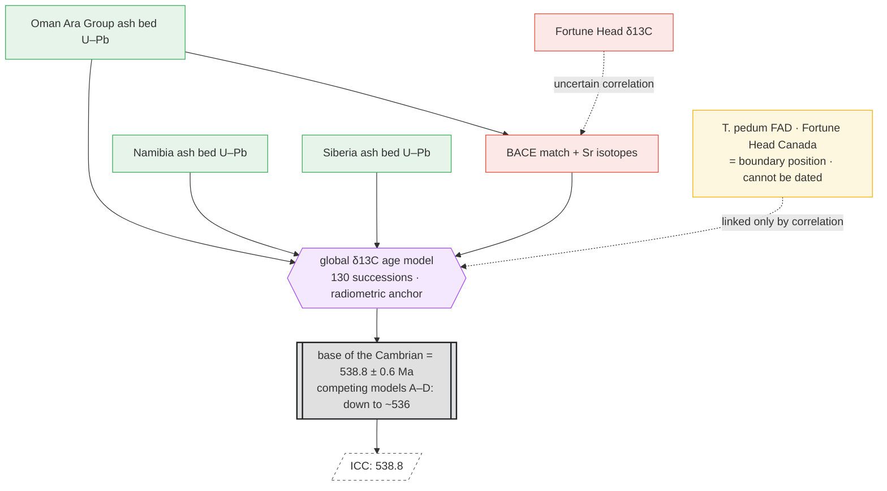

# Case Study — Base of the Cambrian (Fortune Head GSSP): Correlation Is Load-Bearing

*English · [한국어](case-cambrian-base-correlation.md)*

> Status: Third case. Following [case-permian-triassic.md](case-permian-triassic_en.md) (local interpolation) and
> [case-precambrian-gssa.md](case-precambrian-gssa_en.md) (a decided constant), this case examines the
> **middle-tier (b) type, where cross-section correlation produces the number.** Facts checked against the literature (§8).

> **[framing update]** The "Layer 0–6" numbering here is now only a **reading order (narrative)**. The implemented spine is **tier (registry/graph/release) × category (data/process/clamp) + 16 node types** — see [tier-category-model.md](tier-category-model_en.md) · [concept-map.md](concept-map_en.md).

## 1. Why This Case — A Specimen of Tier (b)

In the P–T case, the boundary number came from interpolating between ash beds above and below within the *same section* (tier a).
The base of the Cambrian is the opposite: **the GSSP section itself has no datable ash.**
The number is **pulled in from a datable section on a different continent, via chemostratigraphic correlation.**
On top of that, this correlation is difficult and contested, so the boundary age has swung considerably over time — showing both the character and the risk of tier (b) at once.

## 2. Boundary Definition (Layer 1 / GSSP)

- **Position:** Fortune Head, Burin Peninsula, southeastern Newfoundland, Canada. In the Chapel Island Formation, 23 m above the
  base of Member 2A (Quaco Road Member). **Ratified 1992.**
- **Marker:** first appearance datum (FAD) of the trace fossil ***Treptichnus pedum***.
- Known issue: the GSSP point lies **above** the actual first appearance of *T. pedum*, and this bed is hard to correlate
  precisely with most paleocontinents such as Siberia and South China → proposals to reassess the GSSP have even been put forward.

## 3. The Primary Observations Are 'Elsewhere' (Layer 2)

Fortune Head has no radiometric age anchor. The datable ash beds that supply the number are on **other continents**:

- **Oman (Ara Group)** — U–Pb ash beds. Classic value **542.0 ± 0.3 Ma** (Precambrian–Cambrian boundary).
- **Namibia**, **Siberia** — U–Pb on their respective ash beds.
- Recent high-precision CA-ID-TIMS realigns these to **near 538.8 Ma**. (Caveat: the Oman ash bed shows evidence of an erosion
  surface and reworking, so it may predate the actual excursion.)

Each observation, as in the P–T case, is an invariant, citable fact — but it sits in a different section, physically removed from the boundary point.

## 4. Correlation Produces the Number (Layer 4 — Load-Bearing)

What links the boundary point (Fortune Head) to the datable ash beds (Oman and others) is **chemostratigraphic correlation**:

- **BACE (basal Cambrian carbon isotope excursion)** — the negative (–) excursion in basal Cambrian δ¹³C. A global marker.
- A composite δ¹³C curve plus **Sr isotope stratigraphy** ties together sections across several continents and **anchors them to radiometric ages**.
- Recent work constructs a global age model over **130 successions** (δ¹³C_carb + ⁸⁷Sr/⁸⁶Sr + U–Pb).

**The result is unstable.** The current ICS value is **538.8 ± 0.6 Ma** (base of the Terreneuvian/Fortunian), but competing age models
(A–D) place BACE at different temporal positions, leaving room to view the boundary as **up to ~3 Myr younger (~536 Ma)**.
In other words, **the boundary number depends directly on which correlation and age model you choose.**

## 5. Contrasting the Three Cases

| | Boundary position definition | Where the number comes from | Middle tier | ± |
|---|---|---|---|---|
| P–T (Meishan) | GSSP · *H. parvus* FAD | ash bed interpolation in the **same section** | (a) local age-depth | yes (narrow) |
| Precambrian | **GSSA** (number = definition) | decided (committee) | — (no upstream) | none |
| **Base of the Cambrian (Fortune Head)** | GSSP · *T. pedum* FAD | ash beds on a **different continent** + correlation | **(b) cross-section correlation** | **wide · contested** |

## 6. Node Graph



### ASCII Summary

```
 [Oman U–Pb]───┐
 [Namibia]─────┼──▶{global δ13C age model}──▶[[538.8 ± 0.6 Ma]]══▶ ICC
 [Siberia]─────┘            ▲   ▲                (competing: ~536)
                            │   ┊ (Fortune Head position is
        [BACE + Sr]─────────┘   ┊  linked only by correlation · dashed = uncertain)
                                ┊
        [T. pedum FAD · cannot be dated]┄┄┘

  P–T:  data→model→[number]         (number and boundary in the same section)
  Precam: [number]=definition       (no upstream)
  Cambrian: [other-continent data]┄correlation┄▶[number]  (number and boundary in different sections — correlation is the bridge)
```

## 7. Implications for the cdGTS Model

1. **Middle tier (b) is real, load-bearing, and dangerous.** Unlike the local interpolation (a) of the P–T case, here
   correlation is the **main path** to the number. The correlation edge is itself the primary source of uncertainty → this is the
   most blatant example of the node-graph principle that *"edges leak the distribution."*
2. **Gateway provenance crosses continents.** Trace `538.8` back and you arrive not at Fortune Head but at Oman, Namibia, Siberia,
   and the δ¹³C curve. The schema has to accommodate a provenance graph that is **geographically distributed.**
3. **"Age model choice" is a first-class node.** Competing models A–D yield different numbers from the same data →
   the node-graph's *what-if / node swap* is the actual shape of the scholarly debate. In cdGTS it would be natural to place these
   competing models side by side as **alternative graph branches** and show the diff.
4. **The boundary-position node and the age-anchor node are separated.** The GSSP fixes only *where* the boundary is; *when* is
   supplied by the correlation subgraph. A design constraint: the two nodes must not be merged into one.

## 8. Sources

- Cambrian — Wikipedia (base 538.8 Ma, Terreneuvian): https://en.wikipedia.org/wiki/Cambrian
- Fortune Head — Wikipedia: https://en.wikipedia.org/wiki/Fortune_Head
- GSSPs — The Cambrian System (ICS Cambrian Subcommission): https://cambrian.stratigraphy.org/gssps
- Babcock et al. 2014, *J. African Earth Sci.* — Proposed reassessment of the Cambrian GSSP:
  https://www.sciencedirect.com/science/article/abs/pii/S1464343X1400209X
- Bowyer et al. 2022, *Earth-Science Reviews* — Calibrating the temporal and spatial dynamics of the
  Ediacaran–Cambrian radiation (global δ13C age model A–D):
  https://www.sciencedirect.com/science/article/abs/pii/S0012825221004141
