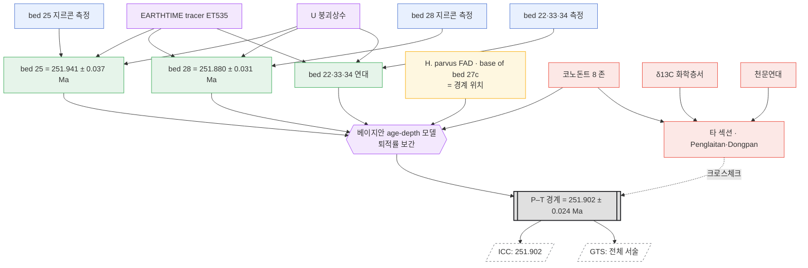

# 케이스 스터디 — Permian–Triassic 경계 (Meishan GSSP)

*[English](case-permian-triassic_en.md) · 한국어*

> 상태: cdGTS의 레이어/게이트웨이 모델([idea.md](idea.md) §5·§8, [node-graph-paradigm.md](node-graph-paradigm.md))을
> **실제 사례에 처음 매핑해본 검증 노트.** 아래 사실은 문헌으로 확인함(§5 출처).

> **[표기 갱신]** 이 문서의 'Layer 0–6' 번호는 이제 **읽기 순서(서사)**로만 유효합니다. 구현의 실제 척추는 **티어(registry/graph/release) × 카테고리(data/process/clamp) + 16개 노드 타입**입니다 — [tier-category-model.md](tier-category-model.md) · [concept-map.md](concept-map.md).

## 왜 이 사례인가

P–T 경계는 **"경계 숫자는 측정값이 아니라 계산의 산출물"** 이라는 cdGTS의 핵심 주장을
가장 깔끔하게 보여주는 사례다. 경계를 정의하는 지점에는 연대측정이 가능한 물질이 없어서,
연대는 **위·아래 화산재층을 잰 뒤 그 사이를 보간(interpolation)** 해서 얻는다.
논문은 이 값을 그대로 *"a mathematical construct"* 라고 부른다.

## 1. 경계 정의 (Layer 1 / GSSP)

- **위치:** Meishan D 섹션, **Bed 27c의 밑**, 중국 저장성 창싱현(Changxing). **2001년 IUGS 비준.**
- **마커:** 코노돈트 ***Hindeodus parvus*** 의 최초출현(FAD).
- 경계는 **생물학적 "지점"으로 정의**되며 **정의 자체엔 숫자가 없다.** 연대는 파생값.

## 2. 원시 관측 (Layer 2 — 불변·인용 가능한 사실)

Burgess, Bowring & Shen (2014, *PNAS*)이 주 멸종 구간에 걸친 **화산재층 5개(bed 22, 25, 28, 33, 34)**의
지르콘을 **CA-ID-TIMS U–Pb**로 측정. **EARTHTIME tracer(ET535)** 로 보정, 이 tracer 덕분에
타 실험실과 0.05 % 수준 이하로 비교 가능.

경계를 위·아래로 감싸는 두 층:

| 층 | 연대 (206Pb/238U) | 경계 대비 위치 |
|---|---|---|
| **Bed 25** | **251.941 ± 0.037 Ma** | 경계 아래 |
| **Bed 28** | **251.880 ± 0.031 Ma** | 경계 약 8 cm 위 |

각 관측의 "사실" 단위: 시료 · 방법(CA-ID-TIMS) · tracer(ET535) · 붕괴상수 · 실험실 · 2σ · 층서 위치.

## 3. 프로세스 — 경계 연대는 *보간된 값* (Layer 3)

- 경계 지점(*H. parvus* FAD)에는 datable한 지르콘이 **없다.**
- 두 재층(bed 25·28, 그리고 22·33·34가 추가 제약)을 **베이지안 age-depth 모델(퇴적률 기반)** 로 종합,
  경계 위치에서의 연대를 **보간**.
- 결과: **251.902 ± 0.024 Ma** — 문헌 표현 그대로 *"a mathematical construct"*.

## 4. 상관 / 글로벌 (Layer 4 — correlation 티어)

- Meishan에 **코노돈트 8개 존**(*Clarkina yini → C. meishanensis → Hindeodus changxingensis →
  C. taylorae → H. parvus → Isarcicella staeschei → I. isarcica → C. planata*)이 설정되어
  재층·연대·생물사건을 엮음.
- 타 섹션(Penglaitan, Dongpan 등)과 **생층서 · 화학층서(δ¹³C 급감) · 천문연대**로 상관 →
  경계를 전 지구로 전파하고 교차검증.

## 5. cdGTS 모델에 매핑

| cdGTS 레이어 | P–T 사례에서 |
|---|---|
| Layer 1 (경계 정의, GSSP) | Meishan Bed 27c, *H. parvus* FAD, 2001 비준 |
| Layer 2 (원시 관측) | bed 22·25·28·33·34 지르콘 U–Pb 연대 (+ tracer·붕괴상수) |
| Layer 3 (age model) | 베이지안 age-depth 보간 → 251.902 ± 0.024 |
| Layer 4 (correlation) | 코노돈트 존, δ¹³C, 타 섹션, 천문연대 |
| Layer 6 (배포) | ICC = "251.902" (bake) / GTS = 전체 서술(narrate) |

## 6. 이 사례가 증명 / 수정하는 것

1. **"숫자는 계산의 산출물"이 문자 그대로 참.** 경계 연대는 관측이 아니라 보간의 결과 —
   문헌이 *"mathematical construct"* 라고 명시.
2. **게이트웨이 = bake / 네트워크 = narrate 구조가 실제 문헌과 일치.** ICC의 "251.902"는 얼린 스냅샷,
   그 산출 과정 전체가 그 아래의 노드 네트워크.
3. **버전/CI 논지의 살아있는 증거.** 과거 Bed 28은 옛 TIMS로 **252.5 ± 0.3 Ma**였는데,
   EARTHTIME tracer 재보정·CA-ID-TIMS 이후 **251.880 ± 0.031**로 이동.
   → **원시 시료는 그대로인데 상류의 "tracer·붕괴상수 노드"가 바뀌자 하류 경계 숫자가 통째로 이동.**
   이것이 곧 *증분 재평가 / 노드 스왑 → diff*.
4. **§8.1에 대한 수정.** 앞서 "경계 숫자는 흔히 *다른 지역*에서 correlation으로 온다"고 했으나,
   이 사례에선 *같은 섹션의 다른 층* 사이 **age-depth 보간**이 load-bearing이다
   (경계 지점 자체를 못 재므로). cross-section correlation은 **글로벌 전파와 존 설정**에서 load-bearing.
   → 중간 티어는 하나가 아니라 **(a) 국소 보간**과 **(b) 섹션 간 상관**의 서로 다른 두 성격으로 갈린다.

## 7. 노드 그래프

같은 사례를 DAG로. 노드 유형: `데이터(leaf)` · `관측(dated)` · `정의` · `프로세스/모델` ·
`상관` · `게이트웨이` · `출력`.



### ASCII 요약 (렌더 안 될 때)

```
 tracer(ET535) ─┐        붕괴상수 ─┐
                ▼                  ▼
 [bed25 측정]→(연대 251.941±0.037)─┐
 [bed28 측정]→(연대 251.880±0.031)─┤
 [22·33·34 측정]→(연대)────────────┤
 [H.parvus FAD = 경계 위치]────────┼─▶{age-depth 모델}─▶[[251.902±0.024]]═╤═▶ ICC(bake)
 [코노돈트 8존]────────────────────┘                                      └─▶ GTS(narrate)
        └───▶(타 섹션·δ13C·천문연대 상관)······크로스체크······▲
```

### 그래프에서 바로 읽히는 것

- **Provenance = 역추적.** `251.902`에서 엣지를 거꾸로 따라가면 5개 재층·tracer·모델이 전부 드러난다.
- **공유 노드 스왑 → 하류 diff.** `EARTHTIME tracer`·`붕괴상수`는 모든 연대에 물려 있다 —
  이 하나를 바꾸면 bed 25·28 연대가 동시에 움직이고 경계 게이트웨이가 재계산된다(252.5 → 251.902의 정체).
- **게이트웨이 하나, 출력 둘.** `PTB`를 bake하면 ICC 숫자, narrate하면 GTS 서술.
- **correlation은 곁가지이자 크로스체크.** 이 사례의 *숫자*는 국소 보간에서 나오고,
  상관 클러스터는 존 설정과 타 섹션 대조로 값을 **검증·전파**한다(점선).

## 8. 출처

- Burgess, Bowring & Shen 2014, *PNAS* — *High-precision timeline for Earth's most severe extinction*.
  https://www.pnas.org/doi/10.1073/pnas.1317692111 · https://pmc.ncbi.nlm.nih.gov/articles/PMC3948271/
- Induan GSSP 공식 문서(stratigraphy.org): https://stratigraphy.org/gssps/files/induan.pdf
- IUGS — GSSPs of Meishan:
  https://iugs-geoheritage.org/geoheritage_sites/gssps-of-meishan-the-chronostratigraphic-record-of-the-biggest-phanerozoic-mass-extinction/
- Baresel et al. 2017, *Solid Earth* — Precise age for the PTB, Bayesian age–depth modelling:
  https://se.copernicus.org/articles/8/361/2017/se-8-361-2017.pdf
- Permian–Triassic extinction event — Wikipedia:
  https://en.wikipedia.org/wiki/Permian%E2%80%93Triassic_extinction_event
