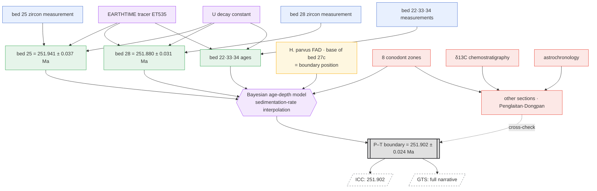

# Case Study — Permian–Triassic Boundary (Meishan GSSP)

*English · [한국어](case-permian-triassic.md)*

> Status: A **verification note from the first attempt to map cdGTS's layer/gateway model** ([idea_en.md](idea_en.md) §5·§8, [node-graph-paradigm_en.md](node-graph-paradigm_en.md))
> onto a real case. The facts below are confirmed against the literature (sources in §5).

## Why This Case

The P–T boundary is the cleanest illustration of cdGTS's core claim that **"the boundary number is not a measurement but the output of a computation."**
There is no datable material at the point that defines the boundary, so the age is obtained by **dating the ash beds above and below and interpolating between them.**
The paper calls this value, verbatim, *"a mathematical construct."*

## 1. Boundary Definition (Layer 1 / GSSP)

- **Location:** Meishan D section, **base of Bed 27c**, Changxing County, Zhejiang Province, China. **Ratified by IUGS in 2001.**
- **Marker:** the first appearance datum (FAD) of the conodont ***Hindeodus parvus***.
- The boundary is **defined as a biological "point,"** and **the definition itself carries no number.** The age is a derived value.

## 2. Primary Observations (Layer 2 — immutable, citable facts)

Burgess, Bowring & Shen (2014, *PNAS*) measured the zircons of **five ash beds (beds 22, 25, 28, 33, 34)** spanning the main extinction interval
by **CA-ID-TIMS U–Pb**. Calibrated with the **EARTHTIME tracer (ET535)**, which makes results comparable across labs to better than the 0.05 % level.

The two beds that bracket the boundary above and below:

| Bed | Age (206Pb/238U) | Position relative to boundary |
|---|---|---|
| **Bed 25** | **251.941 ± 0.037 Ma** | below the boundary |
| **Bed 28** | **251.880 ± 0.031 Ma** | ~8 cm above the boundary |

The "fact" unit of each observation: sample · method (CA-ID-TIMS) · tracer (ET535) · decay constant · lab · 2σ · stratigraphic position.

## 3. Process — the Boundary Age is an *Interpolated Value* (Layer 3)

- There is **no** datable zircon at the boundary point (*H. parvus* FAD).
- The two ash beds (beds 25 and 28, with beds 22, 33, 34 adding further constraints) are combined in a **Bayesian age-depth model (based on sedimentation rate)**,
  and the age at the boundary position is **interpolated**.
- Result: **251.902 ± 0.024 Ma** — in the literature's own words, *"a mathematical construct."*

## 4. Correlation / Global (Layer 3.5 — correlation tier)

- Eight conodont zones are established at Meishan (*Clarkina yini → C. meishanensis → Hindeodus changxingensis →
  C. taylorae → H. parvus → Isarcicella staeschei → I. isarcica → C. planata*), tying together ash beds, ages, and biological events.
- Correlation with other sections (Penglaitan, Dongpan, etc.) via **biostratigraphy · chemostratigraphy (the δ¹³C excursion) · astrochronology** →
  propagates the boundary globally and cross-checks it.

## 5. Mapping onto the cdGTS Model

| cdGTS layer | in the P–T case |
|---|---|
| Layer 1 (boundary definition, GSSP) | Meishan Bed 27c, *H. parvus* FAD, ratified 2001 |
| Layer 2 (primary observations) | beds 22·25·28·33·34 zircon U–Pb ages (+ tracer, decay constant) |
| Layer 3 (age model) | Bayesian age-depth interpolation → 251.902 ± 0.024 |
| Layer 3.5 (correlation) | conodont zones, δ¹³C, other sections, astrochronology |
| Layer 4 (deployment) | ICC = "251.902" (bake) / GTS = full narrative (narrate) |

## 6. What This Case Proves / Corrects

1. **"The number is the output of a computation" is literally true.** The boundary age is the result of interpolation, not observation —
   the literature explicitly calls it a *"mathematical construct."*
2. **The gateway = bake / network = narrate structure matches the actual literature.** ICC's "251.902" is a frozen snapshot,
   and the entire process that produced it is the node network beneath it.
3. **Living evidence for the versioning/CI argument.** Bed 28 used to be **252.5 ± 0.3 Ma** under older TIMS, but after
   EARTHTIME tracer recalibration and CA-ID-TIMS it moved to **251.880 ± 0.031**.
   → **The primary samples are unchanged, yet swapping an upstream "tracer/decay-constant node" shifted the downstream boundary number wholesale.**
   This is precisely *incremental re-evaluation / node swap → diff.*
4. **A correction to §8.1.** Earlier it was said that "the boundary number often comes via correlation from *another region*," but
   in this case the load-bearing step is the **age-depth interpolation** between *different beds in the same section*
   (because the boundary point itself cannot be dated). Cross-section correlation is load-bearing for **global propagation and zone establishment**.
   → The middle tier is not one thing but splits into two distinct characters: **(a) local interpolation** and **(b) cross-section correlation**.

## 7. Node Graph

The same case as a DAG. Node types: `data (leaf)` · `observation (dated)` · `definition` · `process/model` ·
`correlation` · `gateway` · `output`.



### ASCII summary (when rendering fails)

```
 tracer(ET535) ─┐        decay const ─┐
                ▼                  ▼
 [bed25 meas.]→(age 251.941±0.037)─┐
 [bed28 meas.]→(age 251.880±0.031)─┤
 [22·33·34 meas.]→(age)────────────┤
 [H.parvus FAD = boundary pos.]────┼─▶{age-depth model}─▶[[251.902±0.024]]═╤═▶ ICC(bake)
 [8 conodont zones]────────────────┘                                      └─▶ GTS(narrate)
        └───▶(other sections·δ13C·astrochronology corr.)······cross-check······▲
```

### What the Graph Reads Off Directly

- **Provenance = trace back.** Following the edges backward from `251.902` reveals all five ash beds, the tracer, and the model.
- **Shared-node swap → downstream diff.** `EARTHTIME tracer` and `decay constant` feed into every age —
  change this one node and the bed 25 and 28 ages move together and the boundary gateway is recomputed (the identity of the 252.5 → 251.902 shift).
- **One gateway, two outputs.** Bake `PTB` and you get the ICC number; narrate it and you get the GTS narrative.
- **Correlation is both a side branch and a cross-check.** The *number* in this case comes from local interpolation,
  while the correlation cluster **validates and propagates** the value through zone establishment and comparison with other sections (dashed line).

## 8. Sources

- Burgess, Bowring & Shen 2014, *PNAS* — *High-precision timeline for Earth's most severe extinction*.
  https://www.pnas.org/doi/10.1073/pnas.1317692111 · https://pmc.ncbi.nlm.nih.gov/articles/PMC3948271/
- Induan GSSP official document (stratigraphy.org): https://stratigraphy.org/gssps/files/induan.pdf
- IUGS — GSSPs of Meishan:
  https://iugs-geoheritage.org/geoheritage_sites/gssps-of-meishan-the-chronostratigraphic-record-of-the-biggest-phanerozoic-mass-extinction/
- Baresel et al. 2017, *Solid Earth* — Precise age for the PTB, Bayesian age–depth modelling:
  https://se.copernicus.org/articles/8/361/2017/se-8-361-2017.pdf
- Permian–Triassic extinction event — Wikipedia:
  https://en.wikipedia.org/wiki/Permian%E2%80%93Triassic_extinction_event
