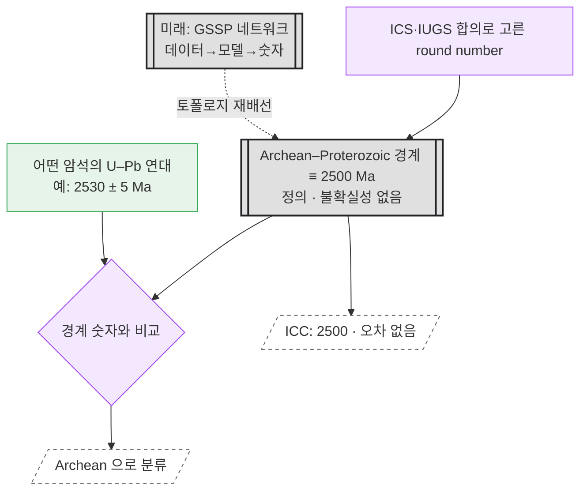

# 케이스 스터디 — 선캄브리아 GSSA (P–T의 거울상)

*[English](case-precambrian-gssa_en.md) · 한국어*

> 상태: [case-permian-triassic.md](case-permian-triassic.md)의 **대조군.** GSSP가 "경계 → 숫자(계산)"라면
> GSSA는 "숫자 → 경계(정의)"로 화살표가 뒤집힌다. 사실은 문헌으로 확인함(§5).

## 1. GSSA란 무엇인가

- **GSSA (Global Standard Stratigraphic Age)** = 특정 노두를 가리키지 않는 **추상적 숫자 연대**.
  ICS/IUGS가 **합의로 정한** 값이며, 대개 **round number**.
- 화석·프록시가 없어 상관이 어려운 **약 630 Ma 이전** 구간에 쓴다
  (단 **Cryogenian·Ediacaran 제외** — 아래).

확인된 값들:

| 경계 | 정의 방식 | 값 |
|---|---|---|
| Archean–Proterozoic | **GSSA** | **2500 Ma** ("근사·전이적" 값으로 지정) |
| Tonian 하부 | **GSSA** | 1000 Ma |
| Cryogenian 하부 | **GSSA** (→ GSSP 전환 **추진 중, 미합의**) | 720 Ma |
| Ediacaran 하부 | **GSSP** (이미 전환됨, 2004 비준) | 635.21 ± 0.57 Ma, Enorama Creek, 호주 |

## 2. 결정적 차이 — 화살표가 뒤집힌다

- **GSSP (P–T):** 원시 관측 → age 모델 → **경계 숫자**. 경계는 **네트워크의 출력**. 숫자엔 **불확실성(±)** 이 붙는다.
- **GSSA (선캄브리아):** **숫자가 곧 정의**. 경계는 계산되지 않는 **입력(leaf)** 이고, 오히려 그 숫자가
  **"자(ruler)"** 가 되어 암석을 분류한다. **불확실성이 없다** — 정의이므로 2500 Ma는 정확히 2500 Ma.

즉 GSSA에는 P–T 그래프의 상류 네트워크(재층·tracer·베이지안 모델)가 **통째로 없다.**

## 3. 노드 그래프



### ASCII 요약

```
GSSA (선캄브리아, 예: Archean–Proterozoic 2500 Ma)

  [ICS 합의 · round number 선택]
             │  (데이터가 아니라 '결정')
             ▼
   [[경계 ≡ 2500 Ma · 오차 없음]]═══▶ ICC: "2500"
             │  (숫자가 '자'가 되어)
             ▼
  [암석 U–Pb 2530±5] ─▶{경계와 비교}─▶ Archean 으로 분류

  ── 화살표가 P–T와 정반대 ──
  P–T (GSSP):  데이터 → 모델 → [경계 숫자]     (경계 = 네트워크의 출력)
  선캄 (GSSA): [경계 숫자] → 암석 분류          (경계 = 입력 / 자, leaf)
```

## 4. cdGTS 모델에 대한 함의

1. **게이트웨이 타입이 경계마다 다르다.** 같은 "경계 게이트웨이"라도
   - GSSP형 = **계산의 출력** (분포 + provenance, ± 있음),
   - GSSA형 = **결정된 상수** (오차 없음, 상류 네트워크 없음).
   → 스키마가 이 **둘을 모두** 담아야 한다. ICC는 실제로 "2500"(오차 없음)과
   "635.21 ± 0.57"(오차 있음)을 **한 표에 공존**시킨다.

2. **토폴로지 버저닝의 실사례.** GSSA→GSSP 전환은 노드 값이 아니라 **배선(wiring) 자체**가 바뀌는 일 —
   *결정된 leaf* 가 *계산된 출력* 으로 재배선된다.
   - **Ediacaran:** 이미 완료(2004, GSSP 635.21 ± 0.57 Ma). 예전 leaf가 P–T식 네트워크로 교체됨.
   - **Cryogenian:** 720 Ma GSSA → GSSP 전환 **추진 중, 미합의**(하부 경계가 침식성이라 연속 퇴적 조건과 충돌).
   → [node-graph-paradigm.md](node-graph-paradigm.md)의 *"토폴로지도 버전 대상"* 이 추상론이 아니라
   지금 진행 중인 실제 사건임을 보여준다.

3. **거버넌스가 노골적으로 드러난다.** GSSA의 상류 노드는 데이터가 아니라 **위원회의 결정**이다.
   게이트웨이 = "비준의 단위"라는 우리 정의가 여기선 문자 그대로다 — 숫자를 만든 것이 곧 합의.

## 5. 출처

- Global Standard Stratigraphic Age — Wikipedia:
  https://en.wikipedia.org/wiki/Global_Standard_Stratigraphic_Age
- Precambrian — Wikipedia: https://en.wikipedia.org/wiki/Precambrian
- Shields et al. 2021, *J. Geol. Soc.* — A template for an improved rock-based subdivision of the
  pre-Cryogenian timescale: https://www.lyellcollection.org/doi/full/10.1144/jgs2020-222
- Defining Cryogenian (ICS Cryogenian Subcommission): https://cryogenian.stratigraphy.org/defining
- ICS International Chronostratigraphic Chart v2024/12:
  https://stratigraphy.org/ICSchart/ChronostratChart2024-12.pdf
