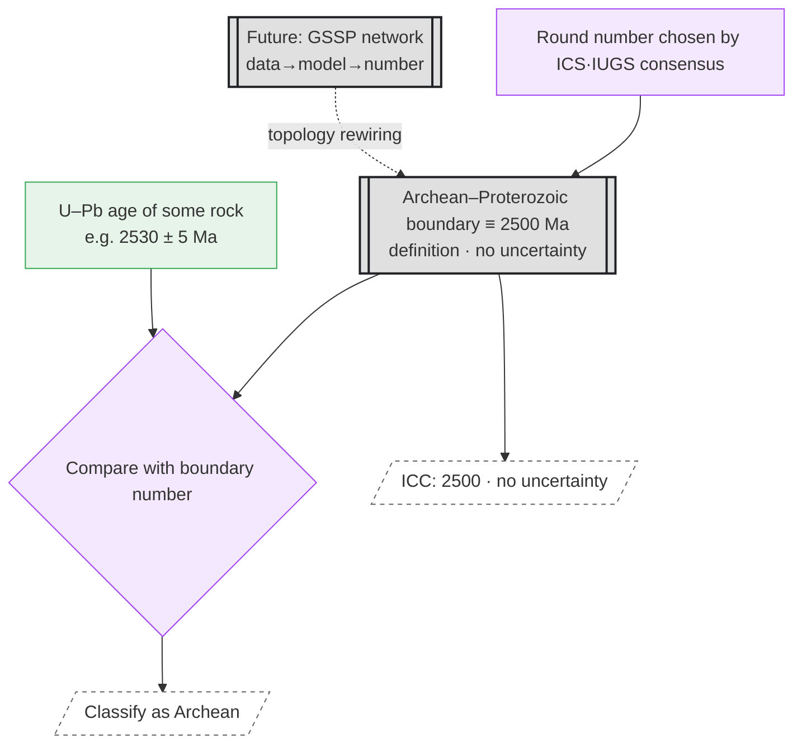

# Case Study — Precambrian GSSA (the Mirror Image of P–T)

*English · [한국어](case-precambrian-gssa.md)*

> Status: The **control case** for [case-permian-triassic_en.md](case-permian-triassic_en.md). If GSSP is "boundary → number (computed),"
> GSSA flips the arrow to "number → boundary (defined)." The facts are confirmed against the literature (§5).

## 1. What Is a GSSA?

- **GSSA (Global Standard Stratigraphic Age)** = an **abstract numerical age** that points to no particular outcrop.
  It is a value **set by consensus** of ICS/IUGS, and is usually a **round number**.
- It is used in the interval **before roughly 630 Ma**, where the absence of fossils and proxies makes correlation difficult
  (but **excluding Cryogenian and Ediacaran** — see below).

Confirmed values:

| Boundary | Definition method | Value |
|---|---|---|
| Archean–Proterozoic | **GSSA** | **2500 Ma** (designated as an "approximate, transitional" value) |
| Base of Tonian | **GSSA** | 1000 Ma |
| Base of Cryogenian | **GSSA** (→ GSSP conversion **in progress, not yet agreed**) | 720 Ma |
| Base of Ediacaran | **GSSP** (already converted, ratified 2004) | 635.21 ± 0.57 Ma, Enorama Creek, Australia |

## 2. The Decisive Difference — the Arrow Flips

- **GSSP (P–T):** raw observations → age model → **boundary number**. The boundary is the **output of the network**. The number carries an **uncertainty (±)**.
- **GSSA (Precambrian):** **the number is the definition itself**. The boundary is an **input (leaf)** that is not computed; rather, that number becomes the
  **"ruler"** that classifies rocks. There is **no uncertainty** — because it is a definition, 2500 Ma is exactly 2500 Ma.

In other words, GSSA has **none** of the upstream network of the P–T graph (restratification, tracers, Bayesian models) — it is absent entirely.

## 3. Node Graph



### ASCII Summary

```
GSSA (Precambrian, e.g. Archean–Proterozoic 2500 Ma)

  [ICS consensus · round number choice]
             │  (a 'decision', not data)
             ▼
   [[boundary ≡ 2500 Ma · no uncertainty]]═══▶ ICC: "2500"
             │  (the number becomes a 'ruler')
             ▼
  [rock U–Pb 2530±5] ─▶{compare with boundary}─▶ classify as Archean

  ── the arrow is the exact opposite of P–T ──
  P–T (GSSP):   data → model → [boundary number]   (boundary = output of the network)
  Precambrian (GSSA): [boundary number] → classify rocks   (boundary = input / ruler, leaf)
```

## 4. Implications for the cdGTS Model

1. **The gateway type differs from boundary to boundary.** Even within the same "boundary gateway,"
   - GSSP type = **the output of a computation** (distribution + provenance, with ±),
   - GSSA type = **a decreed constant** (no uncertainty, no upstream network).
   → The schema must accommodate **both**. ICC in fact lets "2500" (no uncertainty) and
   "635.21 ± 0.57" (with uncertainty) **coexist in a single table**.

2. **A live example of topology versioning.** A GSSA→GSSP conversion is a case where not the node value but the **wiring itself** changes —
   a *decreed leaf* is rewired into a *computed output*.
   - **Ediacaran:** already complete (2004, GSSP 635.21 ± 0.57 Ma). The former leaf was replaced by a P–T-style network.
   - **Cryogenian:** the 720 Ma GSSA → GSSP conversion is **in progress, not yet agreed** (the lower boundary is erosional, which conflicts with the condition of continuous deposition).
   → This shows that the *"topology is also a versioning target"* point in [node-graph-paradigm_en.md](node-graph-paradigm_en.md) is not an abstraction
   but an actual event unfolding right now.

3. **Governance is laid bare.** The upstream node of a GSSA is not data but **a committee's decision**.
   Our definition of a gateway as "the unit of ratification" is literal here — what produced the number is the consensus itself.

## 5. Sources

- Global Standard Stratigraphic Age — Wikipedia:
  https://en.wikipedia.org/wiki/Global_Standard_Stratigraphic_Age
- Precambrian — Wikipedia: https://en.wikipedia.org/wiki/Precambrian
- Shields et al. 2021, *J. Geol. Soc.* — A template for an improved rock-based subdivision of the
  pre-Cryogenian timescale: https://www.lyellcollection.org/doi/full/10.1144/jgs2020-222
- Defining Cryogenian (ICS Cryogenian Subcommission): https://cryogenian.stratigraphy.org/defining
- ICS International Chronostratigraphic Chart v2024/12:
  https://stratigraphy.org/ICSchart/ChronostratChart2024-12.pdf
