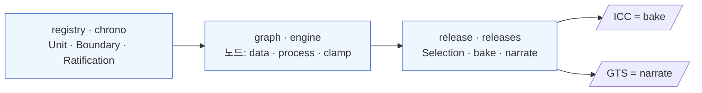

# 통합 개념 지도

*[English](concept-map_en.md) · 한국어*

> 상태: **지도(map).** 지금까지의 모든 문서를 한 장으로 잇고, 반복해서 나타난 **수렴점**을 정리한다.
> 새 주장을 만들지 않고 기존을 봉합한다.

## 0. 한 줄 논지

지질시대표를 표가 아니라 **재현 가능한 노드 그래프(DAG)의 산출물**로 다룬다. 데이터 → 모델 → 경계 연대가
파이프라인이고, 학자는 새 데이터를 continuously integrate 해 그 영향을 **diff**로 본다("과학을 위한 CI").
같은 그래프에서 **ICC(bake, 얼린 스냅샷)** 와 **GTS(narrate, 서술한 책)** 두 산출물이 나온다.

## 1. 척추 — 티어 × 카테고리

> 초기엔 선형 **레이어 L0~6**(§1b)을 척추로 삼았으나, 구현이 이를 **두 축**으로 접었다. 레이어 번호는
> "노드의 *종류*"와 "파이프라인상 *위치*"를 한 축에 눌러담고 있었고, DAG가 되는 순간 위치는 라벨이 될 수
> 없어 **종류만 1급 분류로** 남았다. 전개: [tier-category-model](tier-category-model.md).

**티어** — 깨끗한 계약 세 칸 (§8.2 게이트웨이 아키텍처):

| 티어 | 무엇 | 구현 (앱) |
|---|---|---|
| **registry** | 정본 계약 — 단위·경계·비준·위치 | chrono (Unit·Boundary·Ratification·Locality) |
| **graph** | 노드 네트워크 — 평가되는 파이프라인 | graph·engine (NodeInstance·Edge·Gateway) |
| **release** | 얼린 산출 — 선택·bake·서술 | releases (Release·Selection·BoundaryRecord) |

**카테고리** — graph 티어 *안* 노드의 종류 (`nodes.NodeType.category`):

| 카테고리 | 무엇 | 옛 레이어 | 예 |
|---|---|---|---|
| **data** | 불변·인용 관측 leaf (분포를 그대로 출력) | L2 | radiometric-uPb · astronomical · published-age |
| **process** | 입력 분포 → 산출 분포 (계산) + 기하 조립 | L3·L4·L5 | age-depth-model · cross-section-correlation · calibration-transfer · joint-inference · boundary · unit · merge |
| **clamp** | 순서 제약(order). *별도 clamp 개념은 축소됨* — GSSA=authored leaf·순환=joint 노드로 접힘 ([cycles §12](cycles.md#12-재검토-노트-2026-07--clamp는-별도-개념으로-필요한가)) | 레이어 밖 | order (pin·range·freeze-version 제거) |

### 1b. 레이어 사다리 0–6 — 이제는 서사(읽기) 순서

L0~6 선형 스택은 브레인스토밍의 원래 척추였고, 지금은 **사람이 읽는 서사 순서**(관측→모델→종합→배포)로만
유효하다. 끝단(L0·L1·L6)은 노드가 아니라 **티어 계약**이었고, 중간(L2~L5)만 카테고리로 접혔으며, 순수
번호매기기만 인공물이었다. 문서 인덱스로서의 역사적 사다리:

| Layer | 무엇 | → 지금 | 어디서 다뤘나 |
|---|---|---|---|
| **0 명명** | 이중 명명·위계 (Stage ↔ Age) | registry | [idea](idea.md) §5 |
| **1 경계 정의** | GSSP(지점) · GSSA(결정 숫자) | registry · **authored leaf**(GSSA=published-age) | [idea](idea.md) · 3 사례 |
| **2 원시 관측** | 방사·천문·자기·생층서 (불변·인용) | data | [idea](idea.md) · [P–T](case-permian-triassic.md) |
| **3 국소 age model** | 한 섹션 age-depth 보간 | process | [P–T](case-permian-triassic.md) |
| **4 상관** | 섹션 간 correlation (load-bearing) | process | [캄브리아](case-cambrian-base-correlation.md) |
| **5 전역 종합 / 정합성 게이트** | 경계 집합 → 정합 차트 | process · **order edge**(L1) | [coherence-gate](coherence-gate.md) · [cycles](cycles.md) |
| **6 배포** | ICC(bake) · GTS(narrate) | release | [idea](idea.md) · [versioning](versioning-global-vs-per-boundary.md) |

## 2. 문서 지도

**레퍼런스 (자동 생성)**
- [node-manual.md](node-manual.md) — **카테고리별 노드 매뉴얼** (`manage.py node_manual` 이 시드 × 커널 × 실제 사용처를 조립). 어떤 노드가 무슨 기능을 갖고 어디 쓰이는지 · **미사용 타입**이 무엇인지. 손으로 고치지 말 것 — 산문은 `seed/02_nodes.json` 의 `description`/`help` 와 커널 docstring 에 넣는다.

**튜토리얼 (손으로)**
- [tutorial-science-engine.md](tutorial-science-engine.md) — Science Engine(공분산·정합성 게이트·clamp)을 배포판에서 눌러보며 이해 (Arc A / P06)

**개념**
- [naming.md](naming.md) — 이름·표기 결정과 근거 (Continuously Deployed · geologic · Time Scale)
- [idea.md](idea.md) — 배경·문제의식·레이어 0–6·게이트웨이·열린 질문
- [node-graph-paradigm.md](node-graph-paradigm.md) — DAG·게이트웨이/네트워크·순환·엣지=분포
- [tier-category-model.md](tier-category-model.md) — 구현 후 회고: 레이어 0–6 → 티어 × 카테고리(data/process/clamp)

**사례 (세 유형)**
- [case-permian-triassic.md](case-permian-triassic.md) — GSSP · 국소 보간 (숫자는 계산)
- [case-precambrian-gssa.md](case-precambrian-gssa.md) — GSSA · 결정 (숫자가 정의, 화살표 반대)
- [case-cambrian-base-correlation.md](case-cambrian-base-correlation.md) — GSSP · 섹션 간 상관 (숫자는 타 대륙에서)
- [gssp-gssa-key-papers.md](gssp-gssa-key-papers.md) — GSSP·GSSA 핵심 논문 목록 (정의 데이터·age model·ratification notice; 검증된 서지)
- [gtc-boundaries-report.md](gtc-boundaries-report.md) — **전 경계 종합 보고서** (선캄브리아~현생누대 모든 경계별 정의·discussion·근거 논문; 위 문서의 완전판)

**스키마 & 설계**
- [boundary-gateway-schema.md](boundary-gateway-schema.md) — 경계 게이트웨이 스키마 v0 (§4 열린 질문 5개 모두 정리됨)
- [boundary-span-duality.md](boundary-span-duality.md) — 그래프 계층의 경계(점)·구간(그룹) 이중성: 경계는 참조·독립, order 노드→order edge
- [versioning-global-vs-per-boundary.md](versioning-global-vs-per-boundary.md) — 전역 vs 경계별 (레코드 + 매니페스트)
- [coherence-gate.md](coherence-gate.md) — Layer 5, 검사 사다리 L0–L3
- [evaluation-order.md](evaluation-order.md) — 평가 순서 = 의존순(topo) ≠ 연대순 · order = 사후 검사
- [competing-models.md](competing-models.md) — 네트워크 복수 후보 + 릴리스 선택
- [cycles.md](cycles.md) — 국소=동시추정 / 전역=버전 나선 + clamp (**§12 재검토: clamp 축소 → authored leaf**)
- [topology-diff.md](topology-diff.md) — 값 diff와 직교하는 구조 diff
- [distribution-representation.md](distribution-representation.md) — 불확실성 충실도 사다리 L0–L5

**참고 (외부 문헌 요약 — 개념 코퍼스 아님, 한국어 단독)**
- [radiogenic_isotope_geochronology_summary.md](radiogenic_isotope_geochronology_summary.md) — GTS2012 Ch.6 (Schmitz, *Radiogenic Isotope Geochronology*): 방사성연대 = 시료·표준물질·붕괴상수·오차모델의 계산 결과 · internal vs external 오차
- [statistical_procedures_summary.md](statistical_procedures_summary.md) — GTS2012 Ch.14 (Agterberg, Hammer & Gradstein, *Statistical Procedures*): 상대 층서척도 × 방사성연대 → cubic smoothing spline(SF·cross-validation·단조 제약) → 경계 보간 → Monte Carlo 신뢰구간. **§21–26 은 cdGTS 해석**(원저 아님)

**보관 (역사)**
- [archive/](archive/) — 구현으로 대체된 브레인스토밍(원래 Layer 0–6 데이터 모델 등). 현행 아님.

## 3. 수렴점 (여러 문서가 만나는 곳) ★

지도의 알맹이. 서로 다른 스레드가 반복해서 같은 구조로 수렴했다.

1. **provenance 깊이 = 하나의 축.** 한 경계가 도달 가능한 것이 모두 그 provenance의 기계가독 깊이에 종속 —
   **정합성 레벨**([coherence-gate](coherence-gate.md)) · **분포 충실도**([distribution](distribution-representation.md)) ·
   **순환 해소**([cycles](cycles.md)). "발표값+출처"뿐이면 낮은 층, 완전 모델링이면 높은 층.
   → [idea](idea.md) §7의 "계산까지 하나, 발표값+출처인가"가 이 축의 다른 이름.

2. **~~clamp가 통일자~~ → 재검토·축소.** 한때 GSSA=`Clamp{pin}`·순환 절단·분포 연산을 clamp 하나로 봉합한다고
   봤으나, 구현·사용 현황(실 clamp 거의 0, 대부분 데모)상 **별도 개념이 불필요**. 각각 접힌다 — GSSA=authored
   `published-age` leaf · 순환=joint-inference 노드(노드 *안* 캡슐화) · 순서=order edge · freeze=버전 나선.
   통일자는 **authored 노드** 쪽으로 이동. ([cycles §12](cycles.md#12-재검토-노트-2026-07--clamp는-별도-개념으로-필요한가))

3. **ICC/GTS = bake/narrate 이분법이 반복.** 같은 축이 여러 곳에: 정합성 게이트(검증/재조정) ·
   경쟁 모델(선택/포락) · diff(값+거친토폴로지 / 전체배선) · 분포(중간 rung / L5). ICC = 단일 권위 스냅샷,
   GTS = 복수·서술.

4. **게이트웨이/네트워크 2계층이 반복.** 레이어=계약 vs 사이 자유 네트워크 · 경쟁 모델=네트워크 복수후보 +
   게이트웨이 선택 · clamp=네트워크 안에 꽂은 거버넌스 게이트웨이 · 버전=경계레코드(네트워크) + 릴리스 매니페스트(핀).

5. **Layer 5는 여러 이름의 한 노드.** 전역 종합 = 정합성 게이트 = 동시추정(joint) = 공분산 = 분포의 joint.
   여러 문서가 사실 **같은 노드를 다른 각도**에서 본 것.

## 4. cdGTS의 미션 (재정의됨)

"시대표를 자동 계산"이 아니라 **"subcommission이 책임 있는 authored 노드를 놓는 그래프를 주고, 나머지 전파·정합·diff는
기계가 자동으로."** 사람은 authoritative 노드를 authored(값=leaf · 선후=order edge), 기계는 전파·검사·diff.
(옛 "clamp" 프레이밍에서 개정 — [cycles](cycles.md) §9·§12)

## 5. 상태

**정리됨:** 레이어 0–6 → **티어×카테고리 재구성**(구현) · 스키마 v0 · §4 열린 질문 5개(버전·경쟁모델·순환·토폴로지·분포) 전부 ·
clamp 도입 후 **재검토·축소**(별도 개념 불필요 → authored leaf 수렴, §12) · 수렴점 3개(2번은 축소로 개정).

**아직 열림 (각 문서 말미):** 정합성 게이트의 최소 clamp 집합·나선 수렴 · joint 희소 공분산 재구성 정확도 ·
후보 큐레이션 문지기 · 식별자 lineage 형식 · 실제 데이터 포맷/스택(전면 미정).

## 6. 링크

이 문서는 위 문서들(개념·사례·스키마·튜토리얼)의 상위 지도다. 세부는 각 문서로.
