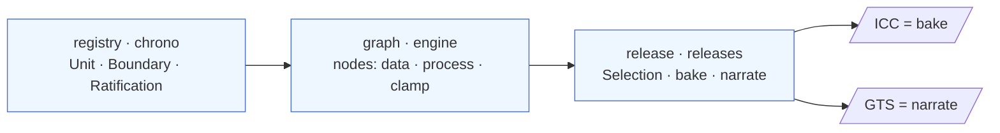

# Integrated Concept Map

*English · [한국어](concept-map.md)*

> Status: **A map.** Ties all the documents so far into one page and collects the **convergence points** that
> recurred. It makes no new claims — it seals up what exists.

## 0. The thesis in one line

Treat the geologic time scale not as a table but as **the output of a reproducible node graph (DAG)**. Data →
models → boundary ages is a pipeline; scholars continuously integrate new data and see the impact as a **diff**
("CI for science"). The same graph yields two outputs — **ICC (bake, a frozen snapshot)** and **GTS (narrate, a
book)**.

## 1. The spine — tier × category

> The original spine was the linear **layer ladder L0–6** (§1b), but the implementation folded it into **two
> axes**. The layer number pressed two different things onto one axis — a node's *kind* and its *position* in
> the pipeline — and once it became a DAG, position could no longer be a label, so only **kind survived as a
> first-class classification**. The development: [tier-category-model](tier-category-model_en.md).

**Tiers** — three clean contracts (§8.2 gateway architecture):

| Tier | What | Implementation (app) |
|---|---|---|
| **registry** | canonical contract — units·boundaries·ratifications·localities | chrono (Unit·Boundary·Ratification·Locality) |
| **graph** | the node network — the evaluated pipeline | graph·engine (NodeInstance·Edge·Gateway) |
| **release** | frozen output — selection·bake·narrate | releases (Release·Selection·BoundaryRecord) |

**Categories** — the *kind* of node *inside* the graph tier (`nodes.NodeType.category`):

| Category | What | Old layer | Examples |
|---|---|---|---|
| **data** | immutable·cited observation leaf (emits its distribution as-is) | L2 | radiometric-uPb · astronomical · published-age |
| **process** | input distributions → output distribution (compute) + geometry assembly | L3·L4·L5 | age-depth-model · cross-section-correlation · calibration-transfer · joint-inference · boundary · unit · merge |
| **clamp** | ordering constraint (order). *The distinct clamp concept was scoped down* — GSSA folds into an authored leaf, cycles into a joint node ([cycles §12](cycles_en.md#12-reconsideration-note-2026-07--is-clamp-needed-as-a-distinct-concept)) | outside the layers | order (pin·range·freeze-version removed) |

### 1b. The layer ladder 0–6 — now a narrative (reading) order

The L0–6 linear stack was brainstorming's original spine; today it holds only as a **human reading order**
(observation → model → synthesis → publication). The ends (L0·L1·L6) were never nodes but **tier contracts**,
only the middle (L2–L5) folded into categories, and the pure numbering alone was the artifact. The historical
ladder, kept as a document index:

| Layer | What | → now | Where covered |
|---|---|---|---|
| **0 Nomenclature** | dual naming · hierarchy (Stage ↔ Age) | registry | [idea](idea_en.md) §5 |
| **1 Boundary definition** | GSSP (point) · GSSA (decreed number) | registry · **authored leaf** (GSSA=published-age) | [idea](idea_en.md) · 3 cases |
| **2 Primary observations** | radiometric·astro·magneto·biostrat (immutable·cited) | data | [idea](idea_en.md) · [P–T](case-permian-triassic_en.md) |
| **3 Local age model** | age-depth interpolation within one section | process | [P–T](case-permian-triassic_en.md) |
| **4 Correlation** | cross-section correlation (load-bearing) | process | [Cambrian](case-cambrian-base-correlation_en.md) |
| **5 Global synthesis / coherence gate** | boundary set → coherent chart | process · **order edge** (L1) | [coherence-gate](coherence-gate_en.md) · [cycles](cycles_en.md) |
| **6 Publication** | ICC (bake) · GTS (narrate) | release | [idea](idea_en.md) · [versioning](versioning-global-vs-per-boundary_en.md) |

## 2. Document map

**Getting started (new here?)**
- [introduction_en.md](introduction_en.md) — what cdGTS is and why it exists (intro for stratigraphers)
- [quickstart_en.md](quickstart_en.md) — **5-minute hands-on**: sign in → fork Example ④ → change one value → one-click diff

**Tutorial (hands-on)**
- [tutorial-science-engine_en.md](tutorial-science-engine_en.md) — click through the Science Engine (covariance · coherence gate · clamps) on the deploy (Arc A / P06)

**Concept**
- [idea_en.md](idea_en.md) — background · problem · layers 0–6 · gateways · open questions
- [node-graph-paradigm_en.md](node-graph-paradigm_en.md) — DAG · gateway/network · cycles · edge = distribution
- [tier-category-model_en.md](tier-category-model_en.md) — retrospective: layers 0–6 → tier × category (data/process/clamp)

**Cases (three types)**
- [case-permian-triassic_en.md](case-permian-triassic_en.md) — GSSP · local interpolation (the number is computed)
- [case-precambrian-gssa_en.md](case-precambrian-gssa_en.md) — GSSA · decreed (the number is the definition; arrows reversed)
- [case-cambrian-base-correlation_en.md](case-cambrian-base-correlation_en.md) — GSSP · cross-section correlation (the number comes from other continents)

**Schema & design**
- [boundary-gateway-schema_en.md](boundary-gateway-schema_en.md) — boundary gateway schema v0 (all five §4 open questions resolved)
- [boundary-span-duality_en.md](boundary-span-duality_en.md) — boundary(point)/span(group) duality in the graph layer: boundaries referenced & independent, order nodes → order edges
- [versioning-global-vs-per-boundary_en.md](versioning-global-vs-per-boundary_en.md) — global vs per-boundary (records + manifest)
- [coherence-gate_en.md](coherence-gate_en.md) — Layer 5, the check ladder L0–L3
- [evaluation-order_en.md](evaluation-order_en.md) — evaluation = dependency (topo) order ≠ chronology · order = a post-hoc check
- [competing-models_en.md](competing-models_en.md) — plural candidates in the network + release selection
- [cycles_en.md](cycles_en.md) — local = joint inference / global = version spiral + clamp (**§12 reconsidered: clamp scoped down → authored leaf**)
- [topology-diff_en.md](topology-diff_en.md) — the structural diff orthogonal to the value diff
- [distribution-representation_en.md](distribution-representation_en.md) — the uncertainty fidelity ladder L0–L5

**Archive (history)**
- [archive/](archive/) — brainstorming superseded by the implementation (e.g. the original Layer 0–6 data model). Not current.

## 3. Convergence points (where documents meet) ★

The heart of the map. Different threads repeatedly converged to the same structure.

1. **Provenance depth = a single axis.** Everything a boundary can reach depends on the machine-readable depth of
   its provenance — **coherence level** ([coherence-gate](coherence-gate_en.md)) · **distribution fidelity**
   ([distribution](distribution-representation_en.md)) · **cycle resolution** ([cycles](cycles_en.md)).
   "Published value + source" only → a low rung; fully modeled → a high rung.
   → [idea](idea_en.md) §7's "does it compute, or published-value + source" is another name for this axis.

2. **~~The clamp is the unifier~~ → reconsidered & scoped down.** It once looked like GSSA=`Clamp{pin}`, cycle-cutting,
   and distribution operations all closed up around one clamp — but on the evidence of usage (near-zero real clamps,
   mostly demo) **a distinct concept is not needed**. Each folds away: GSSA = an authored `published-age` leaf ·
   cycles = a joint-inference node (encapsulated *inside* it) · ordering = an order edge · freeze = the version spiral.
   The unifier moves to the **authored node**. ([cycles §12](cycles_en.md#12-reconsideration-note-2026-07--is-clamp-needed-as-a-distinct-concept))

3. **The ICC/GTS = bake/narrate dichotomy recurs.** The same axis in many places: the coherence gate
   (validate/reconcile) · competing models (select/envelope) · the diff (value + coarse topology / full wiring) ·
   distribution (mid rung / L5). ICC = a single authoritative snapshot, GTS = plural · narrated.

4. **The gateway/network two-layer structure recurs.** Layers = contracts vs the free network between · competing
   models = plural candidates in the network + gateway selection · clamp = a governance gateway plugged inside
   the network · versioning = boundary records (network) + a release manifest (pin).

5. **Layer 5 is one node under many names.** Global synthesis = coherence gate = joint inference = covariance =
   the distribution's joint. Several documents are in fact **one node seen from different angles**.

## 4. cdGTS's mission (redefined)

Not "automatically compute the time scale" but **"give subcommissions a graph on which they place accountable
authored nodes, and automatically propagate / check / diff the rest."** Humans author the authoritative nodes
(value = leaf · ordering = order edge); the machine propagates, checks, diffs. (revised from the old "clamp"
framing — [cycles](cycles_en.md) §9·§12)

## 5. Status

**Resolved:** layers 0–6 → **refactored into tier × category** (in implementation) · schema v0 · all five §4 open questions (versioning · competing models ·
cycles · topology · distribution) · clamp introduced then **reconsidered & scoped down** (converges on an authored leaf, §12) · three convergences (§3-2 revised).

**Still open (at the foot of each document):** the gate's minimal clamp set · spiral convergence · accuracy of
sparse-covariance joint reconstruction · candidate-curation gatekeeping · identifier-lineage format · the actual
data format/stack (entirely undecided).

## 6. Links

This document is the top-level map over the documents above (concepts · cases · schema · tutorial). Details are in each.
