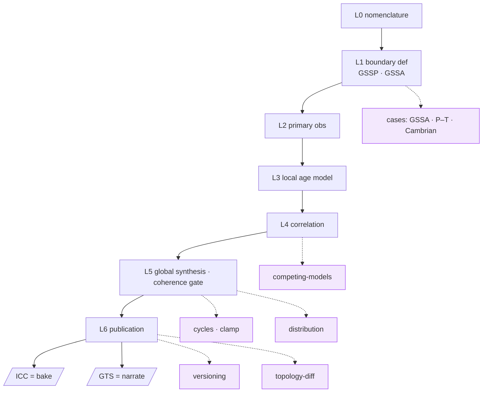

# Integrated Concept Map

*English · [한국어](concept-map.md)*

> Status: **A map.** Ties all the documents so far into one page and collects the **convergence points** that
> recurred. It makes no new claims — it seals up what exists.

## 0. The thesis in one line

Treat the geologic time scale not as a table but as **the output of a reproducible node graph (DAG)**. Data →
models → boundary ages is a pipeline; scholars continuously integrate new data and see the impact as a **diff**
("CI for science"). The same graph yields two outputs — **ICC (bake, a frozen snapshot)** and **GTS (narrate, a
book)**.

## 1. The spine — the layer ladder 0–6

| Layer | What | Where covered |
|---|---|---|
| **0 Nomenclature** | dual naming · hierarchy (Stage ↔ Age) | [idea](idea_en.md) §5 |
| **1 Boundary definition** | GSSP (point) · GSSA (decreed number) | [idea](idea_en.md) · 3 cases |
| **2 Primary observations** | radiometric·astro·magneto·biostrat (immutable·cited) | [idea](idea_en.md) · [P–T](case-permian-triassic_en.md) |
| **3 Local age model** | age-depth interpolation within one section | [P–T](case-permian-triassic_en.md) |
| **4 Correlation** | cross-section correlation (load-bearing) | [Cambrian](case-cambrian-base-correlation_en.md) |
| **5 Global synthesis / coherence gate** | boundary set → coherent chart | [coherence-gate](coherence-gate_en.md) · [cycles](cycles_en.md) |
| **6 Publication** | ICC (bake) · GTS (narrate) | [idea](idea_en.md) · [versioning](versioning-global-vs-per-boundary_en.md) |

## 2. Document map

**Concept**
- [idea_en.md](idea_en.md) — background · problem · layers 0–6 · gateways · open questions
- [node-graph-paradigm_en.md](node-graph-paradigm_en.md) — DAG · gateway/network · cycles · edge = distribution
- [tier-category-model_en.md](tier-category-model_en.md) — retrospective: layers 0–6 → tier × category (data/process/clamp)

**Cases (three types)**
- [case-permian-triassic_en.md](case-permian-triassic_en.md) — GSSP · local interpolation (the number is computed)
- [case-precambrian-gssa_en.md](case-precambrian-gssa_en.md) — GSSA · decreed (the number is the definition; arrows reversed)
- [case-cambrian-base-correlation_en.md](case-cambrian-base-correlation_en.md) — GSSP · cross-section correlation (the number comes from other continents)

**Schema & design**
- [boundary-gateway-schema_en.md](boundary-gateway-schema_en.md) — boundary gateway schema v0 (all five §4 open questions resolved)
- [versioning-global-vs-per-boundary_en.md](versioning-global-vs-per-boundary_en.md) — global vs per-boundary (records + manifest)
- [coherence-gate_en.md](coherence-gate_en.md) — Layer 5, the check ladder L0–L3
- [evaluation-order_en.md](evaluation-order_en.md) — evaluation = dependency (topo) order ≠ chronology · order = a post-hoc check
- [competing-models_en.md](competing-models_en.md) — plural candidates in the network + release selection
- [cycles_en.md](cycles_en.md) — local = joint inference / global = version spiral + **clamp**
- [topology-diff_en.md](topology-diff_en.md) — the structural diff orthogonal to the value diff
- [distribution-representation_en.md](distribution-representation_en.md) — the uncertainty fidelity ladder L0–L5

## 3. Convergence points (where documents meet) ★

The heart of the map. Different threads repeatedly converged to the same structure.

1. **Provenance depth = a single axis.** Everything a boundary can reach depends on the machine-readable depth of
   its provenance — **coherence level** ([coherence-gate](coherence-gate_en.md)) · **distribution fidelity**
   ([distribution](distribution-representation_en.md)) · **cycle resolution** ([cycles](cycles_en.md)).
   "Published value + source" only → a low rung; fully modeled → a high rung.
   → [idea](idea_en.md) §7's "does it compute, or published-value + source" is another name for this axis.

2. **The clamp is the unifier.** GSSA = `Clamp{pin}` = a point mass δ. Cutting a cycle = a `freeze-version` clamp.
   A distribution operation = pin(δ)/range(truncate)/order(truncate). → Three documents
   ([GSSA case](case-precambrian-gssa_en.md) · [cycles](cycles_en.md) · [distribution](distribution-representation_en.md))
   close up around one clamp.

3. **The ICC/GTS = bake/narrate dichotomy recurs.** The same axis in many places: the coherence gate
   (validate/reconcile) · competing models (select/envelope) · the diff (value + coarse topology / full wiring) ·
   distribution (mid rung / L5). ICC = a single authoritative snapshot, GTS = plural · narrated.

4. **The gateway/network two-layer structure recurs.** Layers = contracts vs the free network between · competing
   models = plural candidates in the network + gateway selection · clamp = a governance gateway plugged inside
   the network · versioning = boundary records (network) + a release manifest (pin).

5. **Layer 5 is one node under many names.** Global synthesis = coherence gate = joint inference = covariance =
   the distribution's joint. Several documents are in fact **one node seen from different angles**.

## 4. cdGTS's mission (redefined)

Not "automatically compute the time scale" but **"give subcommissions a graph on which they place accountable
clamps, and automatically propagate / check / diff the rest."** Humans clamp the authoritative nodes; the machine
propagates, checks, diffs. ([cycles](cycles_en.md) §9)

## 5. Status

**Resolved:** integer layers 0–6 · schema v0 · all five §4 open questions (versioning · competing models ·
cycles · topology · distribution) · clamp introduced · three convergences sealed.

**Still open (at the foot of each document):** the gate's minimal clamp set · spiral convergence · accuracy of
sparse-covariance joint reconstruction · candidate-curation gatekeeping · identifier-lineage format · the actual
data format/stack (entirely undecided).

## 6. Links

This document is the top-level map over the twelve documents above. Details are in each.
