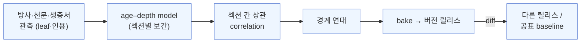

# cdGTS — 표가 아니라 엔진으로서의 지질시대표

*[English](introduction_en.md) · 한국어*

**cdGTS (Continuously Deployed Geologic Time Scale)** — *A graph-based geologic time scale engine.*

## 한 문단 요약

경계 연대 하나가 바뀌면 무슨 일이 벌어지는지, 우리는 대체로 **머릿속과 스프레드시트**로 답합니다. 새 U–Pb 연대가
나오면 age model 을 다시 돌리고, 상관을 다시 맞추고, 인접 경계와 구간 길이를 손으로 점검하지요. cdGTS 는 그
사슬 — **원시 관측 → age model → 상관 → 경계 연대 → 차트** — 을 **실행 가능한 의존성 그래프(DAG)** 로 옮깁니다.
지질시대표를 정기 개정되는 *표·책* 이 아니라, **입력을 바꾸면 결과가 재현 가능하게 다시 전파되는 파이프라인의
산출물** 로 다루는 것입니다. 곧 **엔진**입니다 — 데이터를 바꾸거나 모델을 재튜닝하면 하류 연대가 다시 전파돼
**즉시** 결과를 봅니다. 소프트웨어의 CI/CD 에서 빌린 발상, *"과학을 위한 CI"* 입니다.

> **상태.** cdGTS 는 지질시대표의 계산·근거·개정 과정을 실행 가능한 의존성 그래프로 만드는 것을 *목표*로 합니다.
> 현재 **v0.1.70** — **preliminary·proof-of-concept 단계**의 프로토타입으로, age–depth 계산·제한된 불확실성/공분산 전파·bake·diff·제안/검토/비준 흐름이
> 구현돼 있고, 상수 값 변경에 따른 전면 재계산과 joint Bayesian 추정은 개발 중입니다. 아래 현재형은 "구현된
> slice" 로 읽으시고, 로드맵 항목은 그렇게 표시했습니다.

## 핵심 두 가지

**① 엔진이다 — 입력을 바꾸면 결과가 바로 나온다.** 차트의 모든 숫자는 사람이 책임지고 저작한 leaf(공표 연대·
GSSA) 이거나, 상류 노드에서 *계산된* 파생값입니다. 방사연대를 수정하거나 age–depth 모델을 재튜닝하면 경계
연대가 의존 그래프를 따라 다시 계산됩니다 — 손으로 재유도할 필요도, 낡은 스프레드시트도 없이 "이걸
받아들이면?" 이 살아 있는, 재현 가능한 결과가 됩니다. (공유 보정상수를 바꾸면 지금은 공분산이 다시 배선되고,
의존 연대 *값* 을 rescale 하는 것은 로드맵입니다 — R04 L2.)

**② 버전 관리가 된다 — 모든 결과가 얼린·비교 가능한 릴리스다.** 완성된 그래프는 **불변의 버전 릴리스**(ICC
스냅샷)로 *bake* 됩니다. bake 한 릴리스를 공표 baseline(또는 다른 릴리스)과 **diff** 해서, 어느 경계가 얼마나
움직였고 경계 집합·정의 타입이 어떻게 달라졌는지 요약을 얻습니다. 재현성과 provenance 가 덧붙임이 아니라 기본
내장 — 릴리스는 경계 결과와 인용을 얼리고, 자신을 만든 원본 그래프를 provenance 로 가리킵니다.

## 익숙한 그림, 낯선 형식

지금도 하고 계신 일입니다. 다만 논문·표·개인 노트에 흩어져 있고, 기계가 다시 실행할 수 없을 뿐입니다.
cdGTS 는 이 구조를 1급 시민으로 만듭니다.

- **경계·구간**이 노드입니다(GSSP=물리적 지점 → 연대는 파생값 · GSSA=약속된 숫자 → 연대가 정의, 화살표가 반대).
- **provenance 가 그래프 1급 시민입니다.** 어떤 연대가 어느 관측·어느 보정상수·어느 논문에서 왔는지 엣지로 남습니다.
  경계를 클릭하면 그 숫자가 서 있는 근거 사슬 전체가 보입니다.
- **불확실성이 배선을 따라 흐릅니다.** 두 연대가 같은 ²³⁸U 붕괴상수를 쓰면, 엔진은 그 공유 의존을 알고 둘의
  공분산을 올바르게 전파합니다(순진한 독립 가정이 놓치는 부분).

## 지금 돌아가는 것 (개념이 아니라 배포판)

브레인스토밍으로 시작했지만 지금은 **운영 배포된 웹 앱**입니다 — 노드 에디터로 그래프를 편집하고, 평가하고,
공표 시대표와 diff 를 봅니다. 실제로 재구성해 넣은 예제들:

- **페름–트라이아스 경계** — GSSP(메이샨), 국소 age-depth 보간으로 연대가 *계산*되는 전형.
- **캄브리아기 base(Base of Cambrian)** — Oman·Namibia·Siberia 세 섹션의 U–Pb ash bed 가 δ¹³C BACE 이상을
  bracket → age-depth → 대륙 간 상관 → 그 연대 보정을 *T. pedum* FAD 로 **전이** → 경계 연대(≈538.8 Ma). 연대가 **다른
  대륙에서** 오는 상관 주도 사례.
- **선캄브리아 GSSA** — 숫자가 정의인 경우(화살표 반대).
- **ICC 전 계층 재구성** — period 를 노드그룹(span)으로, age 경계를 order edge 체인으로 엮어 Eon~Age 전체를
  하나의 그래프로 조립한 예제(노드 수백 개). age→period→era→chart 로 merge.

같은 그래프에서 두 산출물이 나옵니다 — **ICC = bake**(얼린 권위 스냅샷) · **GTS = narrate**(구조화 필드에서
결정적 템플릿으로 렌더한 서술, LLM 창작 없음).

## 왜 층서학자가 관심을 가질 만한가

1. **"이 새 근거를 모델에 반영하면 무엇이 바뀌나?" 를 원클릭으로.** 새 방사연대·수정된 age–depth 모델·다른
   상관 가설 — 그래프를 편집 → 재bake → 공표 baseline(앱에 시드된 ICC `ICS-2024/12`) 과 **diff**. 어느 경계가
   얼마나 움직였고, 경계 집합·정의 타입이 어떻게 달라졌는지 요약됩니다. 개정 사이의 "만약에" 를 손계산이 아니라
   재현 가능한 산출로.
2. **정합성 게이트가 조용한 오류를 잡습니다.** authored 한 경계 선후(order) 사슬을 검사하고(L1), 게이트웨이가
   덮는 모든 구간의 duration>0 을 자동 검사합니다(L2 — 영-길이 구간·순서 역전 검출).
3. **경쟁하는 상관은 곧 경쟁하는 그래프입니다.** 상관은 load-bearing 한 가정입니다. 그것이 명시적 엣지로
   존재하므로, 대안 상관은 같은 machinery 로 bake·diff 하는 또 하나의 후보일 뿐입니다 — 추상적 논쟁이 아니라
   모델을 나란히 놓고 비교(경쟁 모델 = 그래프의 복수 후보).
4. **제안·비준이 subcommission 이 실제로 일하는 방식과 닮았습니다.** 로그인 → fork → 편집 → **propose → review
   → ratify**. 권한(Authority·Membership)과 비준 절차가 모델에 들어 있어, 시대표 변경이 GitHub 의 PR 처럼
   리뷰·승인됩니다. 사람은 책임 있는 노드를 authored(값=leaf · 선후=order), 기계는 전파·검사·diff.

## 무엇이 **아닌가** (정직하게)

- **실제 과정의 완전한 기록이 아니라 추상화입니다.** 어떤 경계든 그 뒤의 실제 추론은 어느 그래프보다도 훨씬
  복잡하며, cdGTS 는 그 모든 단계를 담으려 하지 않습니다 — 거의 불가능합니다. 목표는 **발표된 문헌에 기반해**
  GTS 구성 과정을 *개념적으로 일관되게* 재구성하는 것, 즉 의존 관계·근거·결과가 명시적이고 검토 가능해지는
  수준의 추상화입니다.
- **시대표를 자동으로 지어내지 않습니다.** 사람이 responsible 한(load-bearing) 노드를 놓고, 기계는 나머지
  전파·정합·diff 만 합니다. 전문가 판단을 대체하는 게 아니라 **그 판단을 실행 가능·감사 가능하게** 만듭니다.
- **재구성 예제는 시연용입니다** — 기계가 무엇을 할 수 있는지 보이는 예시이지, 경쟁 시대표가 아닙니다.
- **초기 proof-of-concept 단계입니다(v0.1.70).** 스키마와 커널은 돌아가지만, 입력 데이터 포맷·통계 절차(예: joint 베이지안 추정)는
  진화 중입니다.

## 직접 보기

- **라이브**: <https://cdgts.paleobytes.info> — Editor 에서 그래프를 열고 평가·diff 해 보세요.
- **개념 지도**: [concept-map.md](concept-map.md) — 티어(registry·graph·release) × 카테고리, 문서 전체 지도.
- **사례 3종**: [P–T(GSSP·국소 보간)](case-permian-triassic.md) · [캄브리아 base(상관 주도)](case-cambrian-base-correlation.md) · [선캄브리아 GSSA(결정 숫자)](case-precambrian-gssa.md).
- **한 문장**: 사람이 authored 노드를 놓는 그래프를 주면, 나머지 전파·정합·diff 는 기계가 — 지질시대표를
  *연구하고 개정하는 과정 그 자체* 를 재현 가능·버전 관리되는 엔진으로.
