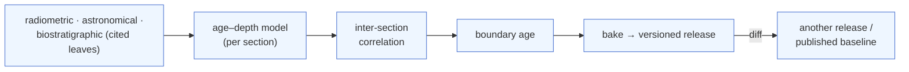

# cdGTS — the Geologic Time Scale as an engine, not a chart

*English · [한국어](introduction.md)*

**cdGTS (Continuously Deployed Geologic Time Scale)** — *A graph-based geologic time scale engine.*

## In one paragraph

When one boundary age changes, we usually work out the consequences **by hand and in spreadsheets**: a new
U–Pb date lands, so you re-run an age model, re-fit a correlation, and manually check the neighbouring
boundaries and unit durations. cdGTS turns that whole chain — **raw observations → age model → correlation →
boundary age → chart** — into an **executable dependency graph (DAG)**. The time scale stops being a *chart or
book* revised every few years and becomes **the output of a pipeline that recomputes, reproducibly, whenever you
change an input**. It is an *engine*: swap a datum or retune a model, and the downstream ages re-propagate so
you see the effect **immediately** — the idea borrowed from software CI/CD, *"CI for science."*

> **Status.** cdGTS *aims* to make the computation, evidence, and revision of the time scale an executable
> dependency graph. Today, at **v0.1.70**, it is a **preliminary, proof-of-concept prototype**: age–depth computation, limited uncertainty/covariance
> propagation, bake & diff, and a propose/review/ratify flow are implemented; full value-recomputation and joint
> Bayesian estimation are in progress. Read the present tense below as "the implemented slice"; roadmap items are
> flagged as such.

## Two things to take away

**① It is an engine — change an input, see the result at once.** Every number in the chart is either a leaf a
person authored (a published age, a GSSA) or a value *computed* from the nodes upstream of it. Edit a
radiometric age or retune an age–depth model and the boundary ages recompute along the dependency graph — no
manual re-derivation, no stale spreadsheet, so "what if we accept this?" becomes a live, reproducible result.
(Changing a shared calibration constant re-wires the covariance today; rescaling the dependent age *values* is
on the roadmap — R04 L2.)

**② It is versioned — every result is a frozen, comparable release.** A completed graph is *baked* into an
**immutable, versioned release** (an ICC snapshot). You can **diff** a baked release against the published
baseline (or against another release) and get a summary of which boundaries moved and how the boundary set and
definition types changed. Reproducibility and provenance are built in, not bolted on: a release freezes the
boundary results and their citations, and points back to the source graph that produced it as provenance.

## The familiar picture, in an unfamiliar form

This is work you already do — it just lives scattered across papers, tables, and private notes, and no machine
can re-run it. cdGTS makes that structure a first-class citizen.

- **Boundaries and units are nodes.** GSSP boundaries are defined by a physical point → their ages are *derived*;
  GSSA boundaries are defined by a decreed number → the age *is* the definition, and the arrows point the other way.
- **Provenance is first-class.** Which observation, which calibration constant, which paper a given age rests on
  is recorded as edges. Click a boundary and you see the whole chain of evidence its number stands on.
- **Uncertainty flows along the wiring.** If two ages share the same ²³⁸U decay constant, the engine knows the
  shared dependency and propagates their covariance correctly — the part a naive independence assumption misses.

## What is actually running (deployed, not a concept)

It began as a brainstorm but is now a **deployed web app**: a node editor where you edit a graph, evaluate it,
and diff it against the published time scale. Worked examples reconstructed into the engine:

- **Permian–Triassic boundary** — GSSP (Meishan); the canonical case where the age is *computed* by local
  age–depth interpolation.
- **Base of Cambrian** — U–Pb ash beds in three sections (Oman, Namibia, Siberia) bracket the δ¹³C BACE
  excursion → age–depth → cross-continental correlation → calibration transfer to the *T. pedum* FAD → the
  boundary age (≈538.8 Ma). The correlation-driven case where the age comes from **another continent**.
- **Precambrian GSSA** — the case where the number is the definition (arrows reversed).
- **A full ICC reconstruction** — periods as node groups (spans), age boundaries wired as order-edge chains, the
  whole Eon-to-Age column assembled into one graph (hundreds of nodes), merged age→period→era→chart.

One graph yields two products — **ICC = bake** (a frozen, authoritative snapshot) and **GTS = narrate** (prose
rendered deterministically from structured fields; no LLM invention).

## Why a working stratigrapher should care

1. **"If we accept this new date, what changes?" — in one click.** Edit the graph → re-bake → **diff** against
   the published baseline seeded in the app (ICC `ICS-2024/12`). See which boundaries moved, by how much, and
   how the boundary set and definition types changed. The between-editions "what if" becomes a reproducible
   artifact, not hand arithmetic.
2. **Coherence gates catch silent errors.** The engine checks the authored boundary-succession (order) chains
   (L1) and automatically verifies that every unit spanned by a gateway has duration > 0 (L2 — catching
   zero-length units and reversed successions).
3. **A competing correlation is just a competing graph.** Correlation is a load-bearing assumption; because it
   lives as an explicit edge, an alternative correlation is simply a different candidate you bake and diff with
   the same machinery — models compared head-to-head instead of argued in the abstract (competing models =
   multiple candidates in one graph).
4. **Propose / ratify mirrors how a subcommission actually works.** Log in → fork → edit → **propose → review →
   ratify**. Authorities, memberships, and a ratification step are in the model, so a time-scale change is
   reviewed and approved like a pull request. Humans author the responsible nodes (values = leaves, ordering =
   order edges); the machine propagates, checks, and diffs.

## What it is **not** (honestly)

- **It does not invent a time scale.** People place the responsible (load-bearing) nodes; the machine only
  propagates, reconciles, and diffs. It does not replace expert judgement — it makes that judgement
  **executable and auditable**.
- **The reconstructed examples are demonstrations** of what the machinery can do, not a competing time scale.
- **It is an early, proof-of-concept prototype (v0.1.70).** The schema and kernels run, but input data formats and some statistical procedures (e.g.
  joint Bayesian estimation) are still evolving.

## See it

- **Live**: <https://cdgts.paleobytes.info> — open a graph in the Editor, evaluate it, and diff it.
- **Concept map**: [concept-map.md](concept-map_en.md) — tiers (registry · graph · release) × node categories, and the full document map.
- **Three cases**: [P–T (GSSP · local interpolation)](case-permian-triassic_en.md) · [Base of Cambrian (correlation-driven)](case-cambrian-base-correlation_en.md) · [Precambrian GSSA (decreed number)](case-precambrian-gssa_en.md).
- **In one line**: give the machine a graph in which people place the authored nodes, and it handles the rest —
  propagation, coherence, and diff — turning *the process of studying and revising the time scale itself* into a
  reproducible, versioned engine.
